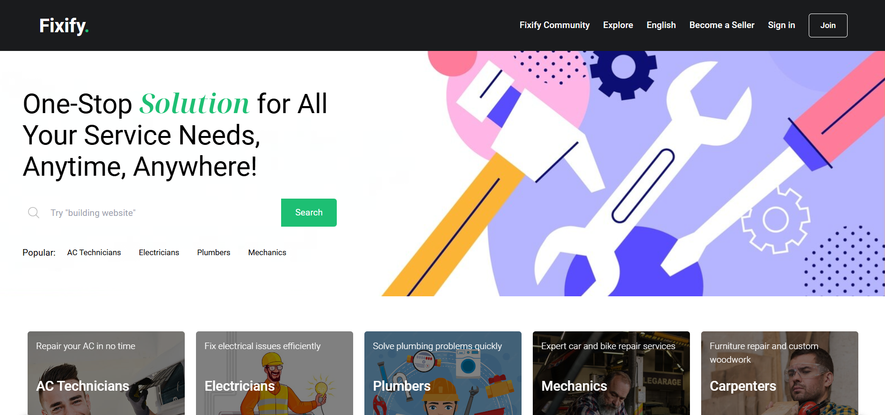
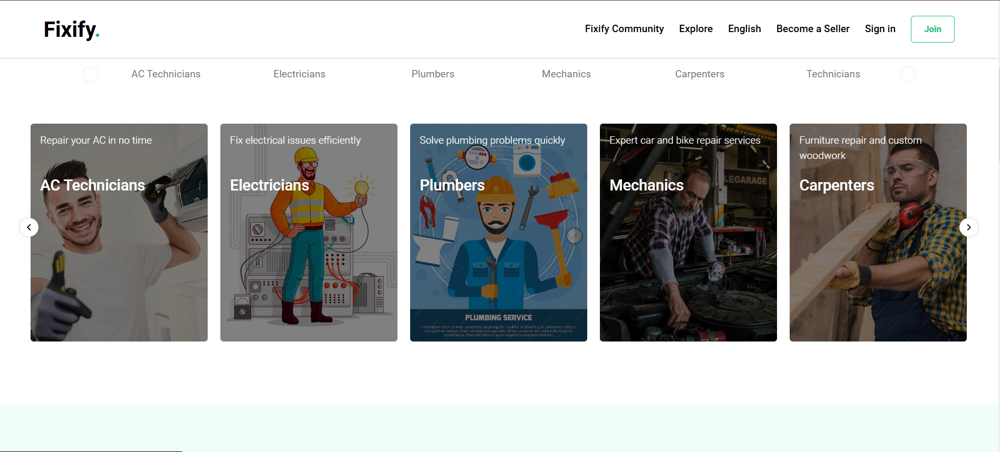
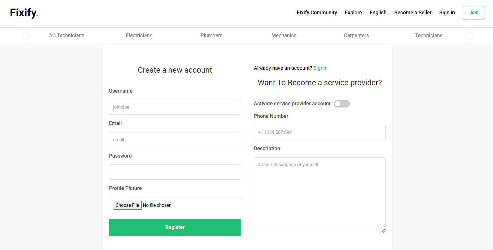
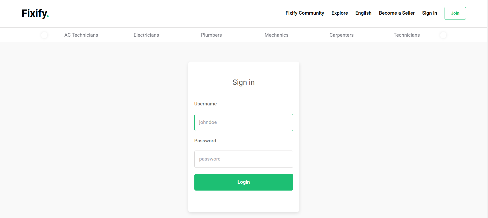

# ZETAONE: One-Stop Solution for All Your Service Needs

ZETAONE (Fixify) is a comprehensive platform designed to connect service providers like AC technicians, electricians, plumbers, and more with customers. The platform offers reliable, efficient, and accessible solutions for maintenance and service needs.

## Project URL

Visit the repository: [Fixify on GitHub](https://github.com/nischal-shetty2/Fixify)

## project images






## Features

### User Management

- _User Registration & Login_: Separate workflows for customers and service providers.
- _User Profiles_: Includes basic information, contact details, location, and preferences.
- _Role-Based Access_: Differentiates between customers and service providers.

### Service Listings

- Categorization and detailed descriptions of services.
- Pricing, availability, and search/filter options for easy navigation.

### Booking & Scheduling

- Book services instantly or schedule for later.
- Integrated calendar for service providers.
- Notifications for confirmations and reminders.

### Location Integration

- GPS-enabled tracking for service providers.
- Customer location-based service suggestions.

### Payment Gateway

- Razorpay integration for seamless payments.
- Supports UPI, credit/debit cards, and wallets.
- Generates invoices and tracks payment history.

### Review & Rating System

- Customers can rate and review service providers.
- Ratings are displayed to assist users in making informed decisions.

### Chat & Communication

- In-app chat between customers and service providers.
- Optional voice or video call support.

### Admin Panel

- User activity monitoring and management.
- Category and service listing controls.
- Handles disputes, refunds, and escalations.

### Analytics & Insights

- Provides user behavior analytics.
- Tracks service provider performance.
- Displays revenue and engagement metrics.

### Promotions & Offers

- Supports discount codes and promotional campaigns.
- Loyalty programs for repeat customers.

### Multilingual and Accessibility Support

- Regional language options.
- Accessibility features for differently-abled users.

## Tech Stack

- _Frontend_: React.js
- _Backend_: Node.js (Express.js)
- _Database_: MongoDB
- _Payment Gateway_: Razorpay
- _Hosting_: To be determined

## Environment Variables

Set up a .env file in the root of the project with the following values:

```plaintext
JWT_SECRET=secret
MONGODB_URI=mongodb://localhost:27017/Fixify
RAZORPAY_KEY_ID=your_id
RAZORPAY_KEY_SECRET= your_key
NODE_ENV=development
DEV_CORS_ORIGIN=http://localhost:5173
PROD_CORS_ORIGIN=http://localhost:5173
```
